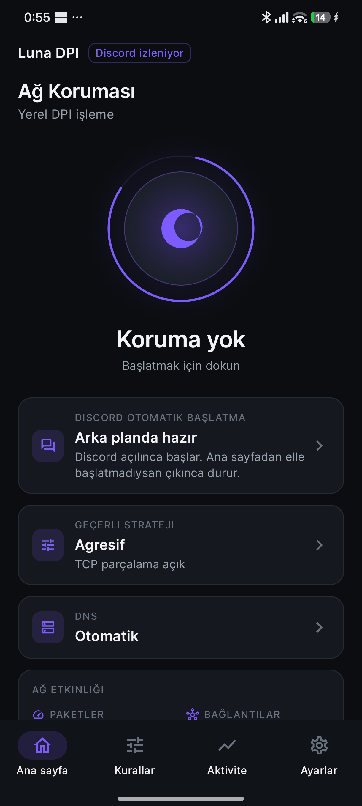
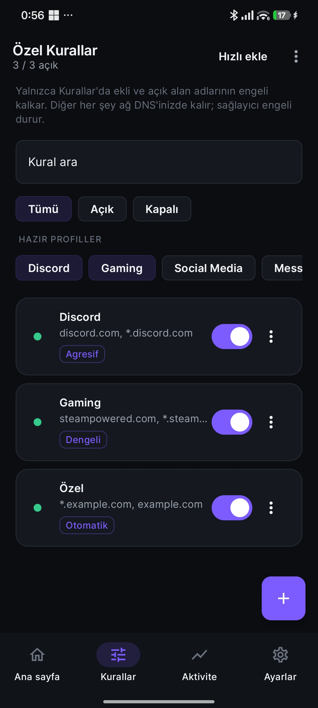
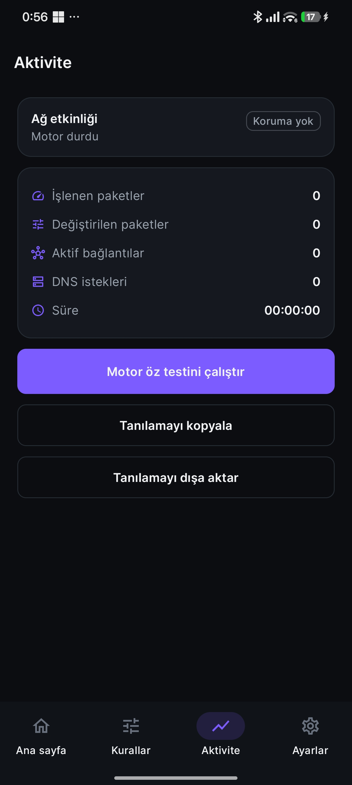
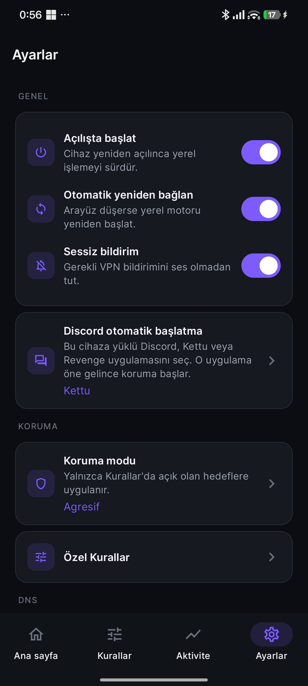

<div align="center">


# Lunas DPI

Telefonunuzda çalışan yerel ağ koruması.  
Uzak sunucu yok · Root gerekmez · Hesap açılmaz

[](../../releases/latest)
[](#nasıl-başlarım)
[](LICENSE)
[](#normal-vpn-değil)
[](#gizliliğiniz)
[](#eklentiler)

[İndir](#indirme) · [Nasıl başlarım](#nasıl-başlarım) · [Kurallar](#kurallar-neden-önemli) · [Eklentiler](#eklentiler) · [Gizlilik](#gizliliğiniz)

</div>

---

> [!IMPORTANT]
> Lunas DPI **bildiğiniz VPN değildir.** IP adresiniz değişmez, konumunuz gizlenmez, trafiğiniz başka bir ülkedeki sunucuya gitmez. Android’in «VPN izni» yalnızca telefonunuzun *içinde* işlem yapmak içindir.

> [!NOTE]
> Engeli kaldırmak istediğiniz site veya servisi **Kurallar** listesine ekleyip anahtarını açmanız gerekir. Listede yoksa veya kapalıysa Lunas DPI o adrese dokunmaz; sağlayıcınızın engeli durur.

## Lunas DPI size ne sağlar?

Bazı internet hatları, bir siteye bağlanırken giden ilk paketlere bakıp belirli servisleri keser. Buna kısaca **DPI** (derin paket incelemesi) denir.

Lunas DPI, sizin seçtiğiniz alan adları için bu ilk paketleri **telefonunuzda** yeniden düzenler. Amaç, filtrenin tanımakta zorlanmasıdır. Şifreli sitenizin içeriği açılmaz; şifre çözme, sahte sertifika veya «araya girme» yoktur.

Kısaca:

- **Yapar:** Açık kurallarınızdaki adresler için yerel işlem (parçalama, DNS, gerekirse tarayıcıyı klasik bağlantıya zorlama).
- **Yapmaz:** Tüm interneti açmak, sizi anonim kılmak, trafiği kendi sunucusundan geçirmek, HTTPS’i okumak.

## Normal VPN değil

| | Lunas DPI | Klasik VPN |
| --- | --- | --- |
| Trafik nereye gider? | Sizin Wi‑Fi veya mobil hattınızdan, doğrudan | Şirketin uzak sunucusundan |
| IP adresiniz | Aynı kalır | Genelde değişir |
| Anonimlik | Yok | Pazarlanan özellik |
| Ne işlenir? | Yalnızca **açık kurallarınızdaki** adresler | Tüneldeki hemen her şey |
| Hesap / abonelik | Yok | Çoğunlukla var |
| Root | Gerekmez | Gerekmez (ama bu yine VPN’dir) |

Android, bu tür yerel işlem için VPN iznini zorunlu tutar. Ekranda «VPN’e bağlanıyorsunuz» yazabilir; Lunas DPI yine de bir VPN firmasına bağlanmaz.

## Nasıl çalışır?

Telefondaki uygulamalar internete çıkmak ister. Koruma açıkken Lunas DPI bu çıkışı kısa bir an kendi üzerinden alır, **Kurallar**’a bakar, sonra paketi sizin normal internetinize verir.

```text
Sizin uygulamalarınız  →  Lunas DPI (yalnızca açık kurallar işlenir)  →  sizin internetiniz
```

1. Ana sayfadaki ay diskine dokunursunuz.
2. Android bir kez VPN izni ister; onaylarsınız.
3. Lunas DPI listede **açık** olan alan adlarını tanır (örneğin `discord.com` ve `*.discord.com`).
4. Bu adresler için bağlantının başını yerelde işler; DNS’i de temiz çözücülerden alır.
5. Listede olmayan her şey, hattınızın DNS’i ve kurallarıyla **olduğu gibi** kalır.

İşlem telefonun dışına çıkmaz. Lunas DPI’nin bir «merkezi» yoktur.

## Arayüz

Dört sekme vardır. Hepsi Türkçe, koyu tema.

<table>
  <tr>
    <td align="center" width="25%">
      
      <br/><sub><b>Ana sayfa</b><br/>Korumayı ay diskine dokunarak açıp kapatırsınız.</sub>
    </td>
    <td align="center" width="25%">
      
      <br/><sub><b>Kurallar</b><br/>Hangi sitelerin işleneceğini siz seçersiniz.</sub>
    </td>
    <td align="center" width="25%">
      
      <br/><sub><b>Aktivite</b><br/>Paket ve bağlantı özeti; tanıyı kopyalayabilirsiniz.</sub>
    </td>
    <td align="center" width="25%">
      
      <br/><sub><b>Ayarlar</b><br/>Açılışta başlatma, Discord otomatik başlatma, koruma modu.</sub>
    </td>
  </tr>
</table>

- **Ana sayfa** — Üstte «Ağ Koruması». Disk «Koruma yok» iken *Başlatmak için dokun* yazar. Discord izleme açıksa mor «Discord izleniyor» rozeti görünür. Altta geçerli strateji (örneğin Agresif) ve DNS (Otomatik) kartları vardır.
- **Kurallar** — Üstteki cümle ürünün özetidir: yalnızca ekli ve açık alan adlarının engeli kalkar. Discord, Gaming, Social Media, Messaging hazır gelir; her satırın anahtarı ve kendi stratejisi vardır.
- **Aktivite** — Koruma kapalıyken sayaçlar sıfırdır. Açınca işlenen paketleri görürsünüz. Sorun olursa tanıyı kopyalayıp paylaşabilirsiniz; içerik telefonunuzda kalır.
- **Ayarlar** — Açılışta başlat, kopunca yeniden bağlan, sessiz bildirim. Discord otomatik başlatmada yüklü istemciyi seçersiniz (örnekte Kettu). Koruma modu yalnızca Kurallar’da açık hedeflere uygulanır. **Eklentiler** Lua ZIP paketlerini içeri alır.

## Eklentiler

Lunas DPI’nin yapabildiği ama üründe hazır gelmeyen işleri siz (veya başkası) Lua ile paketleyebilirsiniz: özel alan adı listesi, eklentiye ait kurallar, yerel hosts ezmesi, uygulama içi ayar sayfası.

- Dil: **Lua**. Paket: klasör → ZIP → **Ayarlar → Eklentiler**.
- Sanal alan: dosya, kabuk, Java, TUN ve ekstra ağ **yok**. HTTPS çözülmez.
- İzinler tek tek gösterilir; eklentiyi siz açınca verilir.
- Ayar sayfası olan bir eklenti, açıkken kendi menüsünü uygulama içinden açar.

Geliştirici ağacı ve API: [docs/plugins.md](docs/plugins.md).

## Kurallar neden önemli?

Lunas DPI «her şeyi aç» düğmesi değildir. Siz listeyi yönetirsiniz.

| Anahtar | Sonuç |
| --- | --- |
| Açık ve adres eşleşiyor | Lunas DPI o adres için yerel işlem yapar |
| Kapalı veya listede yok | Lunas DPI karışmaz; sağlayıcı engeli durur |

Nasıl yazılır?

- `discord.com` yalnızca tam bu adresi tutar.
- Alt adresler için `*.discord.com` ekleyin.
- `https://…` veya `/bir/yol` yapıştırmayın.

Hazır profilleri kullanabilir, kapatabilir veya silebilirsiniz. Discord da diğerleri gibi bir kuraldır; anahtarı kapalıysa Lunas DPI Discord’a özel bir işlem yapmaz.

> [!TIP]
> Yalnızca gerçekten ihtiyaç duyduğunuz satırları açık bırakın. Anahtarı çevirdikten sonra site hâlâ eski gibi davranıyorsa korumayı bir kez durdurup yeniden başlatın.

## Nasıl başlarım?

1. Aşağıdaki [İndirme](#indirme) bağlantısından APK’yı yükleyin. Android 8.0 veya üzeri yeterlidir.
2. İlk açılıştaki kısa tanıtımı geçin.
3. **Kurallar**’a gidin. İstediğiniz profilleri veya kendi alan adınızı açın.
4. **Ana sayfa**’da ay diskine dokunun.
5. Android’in VPN penceresini onaylayın. Android 13 ve sonrasında bildirim izni de istenebilir.

Tarayıcının **gizli sekmesi** bazen kendi şifreli DNS’ini kullanır ve Lunas DPI’yi atlayabilir. Takılırsa tarayıcı ayarlarından «Güvenli DNS»i kapatın.

## Discord otomatik başlatma

İsterseniz Discord’u (veya Kettu / Revenge / diğer modded discord'lar..) açınca koruma kendiliğinden başlar.

- Ayarlar’dan kullandığınız uygulamayı seçin.
- Android **Erişilebilirlik** izni ister. Lunas DPI yalnızca «hangi uygulama önde?» diye bakar; sohbeti veya ekranı okumaz.
- Koruma otomatik başladıysa Discord’dan çıkınca kısa süre sonra kapanır. Ana sayfadan kendiniz başlattıysanız açık kalır.
- Android pil tasarrufu arka planı kesebilir; Lunas DPI ayarlarından kısıtlamayı kapatmanız önerilir.

## Gizliliğiniz

- Kayıt / e‑posta / abonelik yok.
- Gezinme geçmişiniz, paketleriniz veya DNS sorgularınız bir yere yüklenmez.
- Site içeriği şifreliyse Lunas DPI onu okuyamaz.
- Aktivite ekranındaki tanılama siz kopyalamadıkça telefonda kalır.

Sağlayıcınız hâlâ sizin IP adresinizi ve (işlemden sonra) gittiğiniz adresi görebilir. Bu, VPN olmamanın doğal sonucudur.

## Bilmeniz gereken sınırlar

- Her ağda, her site için başarı garanti edilmez. Kendi hattınızda deneyin.
- Yalnızca adres yazmak, IP ile kesilen veya tamamen başka türlü süzülen bir engeli sihirle kaldırmaz.
- Ping gibi bazı sistem trafiği iletilmez.
- IPv6 varsayılan olarak bu yerel yoldan geçmez; karışıklığı önlemek içindir.

## Bir şey ters giderse

| Ne oldu? | Ne yapabilirsiniz? |
| --- | --- |
| İzin penceresini kapattım | Ana sayfadan yeniden başlatın, bu kez onaylayın |
| Kural açık, site hâlâ kapalı | `*.alan.com` ekli mi bakın; korumayı durdurup açın |
| İstemediğim siteler de açıldı | Fazla kuralların anahtarını kapatın |
| Otellerdeki giriş sayfası açılmıyor | Korumayı durdurun, ağa giriş yapın, sonra yeniden başlatın |
| Gizli sekmede garip davranıyor | Tarayıcıda Güvenli DNS’i kapatın |
| Tek bir uygulama bozuldu | Ayarlar’dan o uygulamayı yerel işlemin dışında bırakın |

## İndirme

Güncel sürüm **v1.0.1**. Telefona APK’yı [Releases](../../releases/latest) sayfasından alın.

[](../../releases/latest)

Kaynak kodu bu depodadır. Uygulama [MIT](LICENSE) lisansı altındadır.
